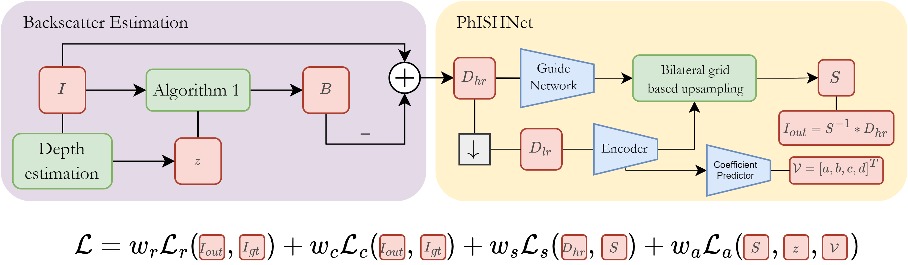
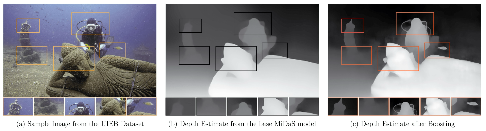
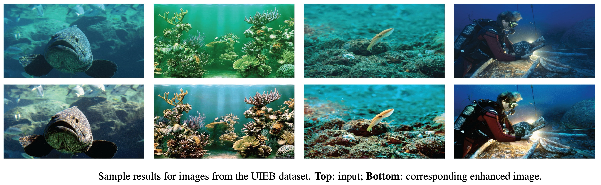
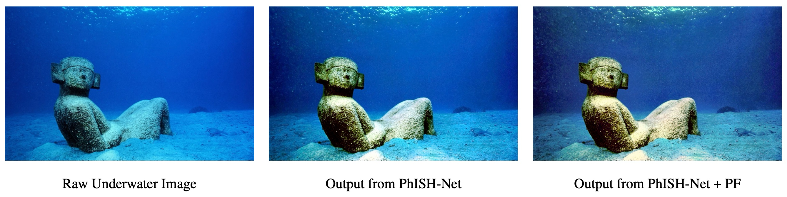

# PhISH-Net

This is the official PyTorch implementation for the WACV 24 paper: "PhISH-Net: Physics Inspired System for High Resolution Underwater Image
Enhancement".



## Requirements

This code was tested with `python=3.8`, `pytorch=1.12.1` and `torchvision=0.13.1`. Please follow the instructions [here](https://pytorch.org/get-started/locally/) to install PyTorch and TorchVision dependencies. Installing both PyTorch and TorchVision with CUDA support is strongly recommended.

Create a conda environment with the following dependencies:
```
conda create -n phishnet python=3.8
conda activate phishnet
conda install pytorch==1.12.1 torchvision==0.13.1 cudatoolkit=11.3 -c pytorch
pip install opencv-python scikit-image tqdm rawpy Pillow==9.3.0 h5py==3.9.0 imageio==2.19.3 scikit-image==0.19.3
```

## Getting Started

### Setup ###

Start by downloading the desired dataset (such as [UIEB](https://li-chongyi.github.io/proj_benchmark.html) or [EUVP](https://irvlab.cs.umn.edu/resources/euvp-dataset)) to `./data` with the original images in `./data/raw` and ground truths in `./data/gt`. Additionally, update the files in `./data/splits` with the names of the images in the train and test sets.

In case you wish to only run inference, add the images to `./data/raw`.

**NOTE**: This model requires depth as an input. In this work, we use a depth boosting method to improve depth estimates from base models such as MiDaS and LeReS. To estimate depth using `BoostingMonocularDepth`, please follow the instructions [here](https://github.com/compphoto/BoostingMonocularDepth?tab=readme-ov-file#setup).

```
git clone https://github.com/compphoto/BoostingMonocularDepth.git

wget https://sfu.ca/~yagiz/CVPR21/latest_net_G.pth
mkdir -p ./BoostingMonocularDepth/pix2pix/checkpoints/mergemodel/
mv latest_net_G.pth ./BoostingMonocularDepth/pix2pix/checkpoints/mergemodel/

# MiDaS
wget https://github.com/AlexeyAB/MiDaS/releases/download/midas_dpt/midas_v21-f6b98070.pt
mv midas_v21-f6b98070.pt ./BoostingMonocularDepth/midas/model.pt

# LeReS
wget https://huggingface.co/lllyasviel/Annotators/resolve/850be791e8f704b2fa2e55ec9cc33a6ae3e28832/res101.pth
mv res101.pth ./BoostingMonocularDepth/res101.pth

cd BoostingMonocularDepth/

# MiDaS
python run.py --Final --data_dir ../data/raw --output_dir ../data/depthmaps --depthNet 0

# LeReS
python run.py --Final --data_dir ../data/raw --output_dir ../data/depthmaps --depthNet 2
```

### Usage ###

#### Backscatter Estimation ####

Start by generating the backscatter-removed images using the `./src/preprocess.py` script.

```
cd src/
python preprocess.py --image-path '../data/raw/' --depthmap-path '../data/depthmaps/' --output-path '../data/input/'
```

#### Train ####

The `src/train.py` script takes the following arguments
* `--epochs` : Number of training epochs. (defaults to 50)
* `--batch-size` : Batchsize for training. (defaults to 64)
* `--lr` : Learning rate. (defaults to 1e-4)
* ``--ckpt-path`` : Path to store and check for checkpoints.
* ``--resume`` : Resume from the latest checkpoint in `--ckpt-path`. (defaults to False)
* `--log-interval` : Interval to log losses. (defaults to 10)
* `--ckpt-interval` : Interval to save the model and test it using `--test-image`. The checkpoints are stored in `--ckpt-path` and the test results are stored in `--test-out`. (defaults to 100)

For further details on the internal parameters such as `net-input-size`, `net-output-size`, `luma-bins` etc, please refer to the paper [here](https://openaccess.thecvf.com/content/WACV2024/html/Chandrasekar_PhISH-Net_Physics_Inspired_System_for_High_Resolution_Underwater_Image_Enhancement_WACV_2024_paper.html).

```
CUDA_VISIBLE_DEVICES=0 python train.py --epochs 2 --ckpt-path ../checkpoints/model_test
```

#### Test ####

The pretrained PhISH-Net checkpoint can be found in `./checkpoints/`.

```
CUDA_VISIBLE_DEVICES=0 python test.py --checkpoint ../checkpoints/PhISH-Net.pth --input ../data/input --output ../data/output
```

#### Photofinishing ####

The MATLAB scripts for photofinishing are in `./src/pf`. To generate the results for custom images, change the `results_path` and `folder_path` variables in `main.m`. The outputs are saved to the `results_path`. Sample results can be found at `./src/pf/results`.

```Matlab
main.m
```

### Results ###







### Metrics ###

The proposed PhISH-Net model is evaluated on a set of reference-based (PSNR, PSNR-L, SSIM, and PCQI) and non-reference-based metrics (UCIQE, CCF, UIQM, UICM and UIConM). The script for some of the python based metrics has been provided in `./src/evaluate.py`.

```
python evaluate.py --output-path ../data/output --reference-path ../data/gt
```

## Citation

If you use PhISH-Net or find this work useful for your research, please use the following BibTeX entry.
```bibtex
@InProceedings{Chandrasekar_2024_WACV,
    author    = {Chandrasekar, Aditya and Sreenivas, Manogna and Biswas, Soma},
    title     = {PhISH-Net: Physics Inspired System for High Resolution Underwater Image Enhancement},
    booktitle = {Proceedings of the IEEE/CVF Winter Conference on Applications of Computer Vision (WACV)},
    month     = {January},
    year      = {2024},
    pages     = {1506-1516}
}
```
